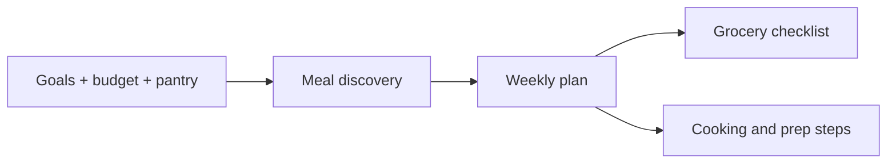

# PrepPilot

Budget-aware meal planning for people learning to cook and prep for the week.

## Experience

Full-screen onboarding collects goals, budget, meal count, cooking confidence, pantry ingredients, and dietary preferences. Discover offers meal choices; Plan assembles the week; Grocery organizes shopping; Cook presents preparation guidance. Profile lets users revisit preferences.

## Implementation

Plain JavaScript, HTML, and CSS with a mobile app shell. A web manifest and service worker provide PWA foundations. The current source persists onboarding, profile, meal selections, meal cart, confirmed plan, and grocery checklist in browser localStorage.

## Tradeoffs

The local prototype avoids account setup and backend dependencies. It does not establish cross-device synchronization, live retailer pricing, or medically validated nutrition advice. Estimated costs and recipe suggestions should be presented as planning aids. No live AI backend is claimed.

## Evidence

The source storage keys and PWA files were inspected for this case study. The supplied development record documents onboarding, navigation, and meal-planning iterations. JavaScript syntax was independently checked for the showcase; a full current browser flow has not been rerun.
