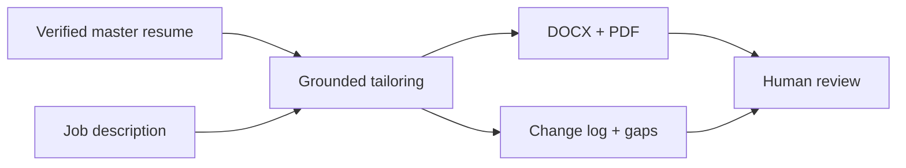

# One of One — Resume Studio

A private workspace for tailoring a resume to a role while keeping every claim grounded in the original experience.

## Workflow

Provide a verified master resume and job description → identify relevant experience and honest gaps → tailor wording and emphasis → produce DOCX, PDF, and a change log → review before use.

## Design decisions

The local project instructions make the master resume the factual source of truth. They require preservation of factual details and forbid inventing employers, skills, metrics, credentials, or experience. Unsupported job requirements remain gaps. The workflow preserves the master file and produces separate outputs for review.

The project README describes a local Studio using the signed-in Codex workflow without requiring an OpenAI API key. A connected Sites project also exists under One of One — Resume Studio. This case study does not imply that the hosted and local versions have identical capabilities.

## Showcase scope

This is a workflow case study. No real resume, contact details, employment history, application records, generated documents, or private configuration are included. No automated job application or employer submission is claimed.

## Evidence

The local README and project workflow instructions were inspected. Generation, document fidelity, and hosted behavior have not been independently retested for this showcase.
