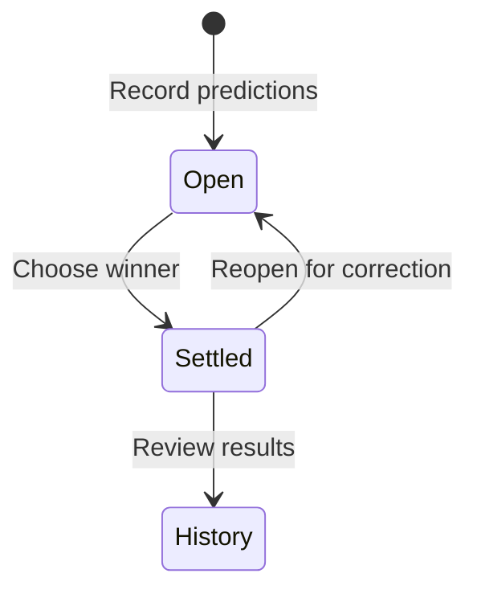

# Sidepot / Betly

A friendly prediction tracker: record both sides, settle the result, and see the history of who was right.

## Experience

Add friends, create a prediction with opposing sides, choose pretend points or a descriptive stake, settle a winner, and review a leaderboard and per-friend history. Settled records can be reopened for correction.

## Implementation

A dependency-free HTML/CSS/JavaScript browser prototype. The current README documents friend management, prediction records, settlement, leaderboard, and history; source uses localStorage under `sidepot.board.v1`.

## Boundaries

No payments, deposits, real-money wagering service, or shared account backend. Descriptive stakes are records, not transfers handled by the app. Browser-local persistence means friends do not automatically see a synchronized board on separate devices.

## Evidence

The local README and persistence entry point were inspected, and JavaScript syntax was checked. Current settlement and leaderboard behavior have not been independently exercised end to end for this case study. The source project uses Sidepot Board branding and is saved in a Betly folder.
